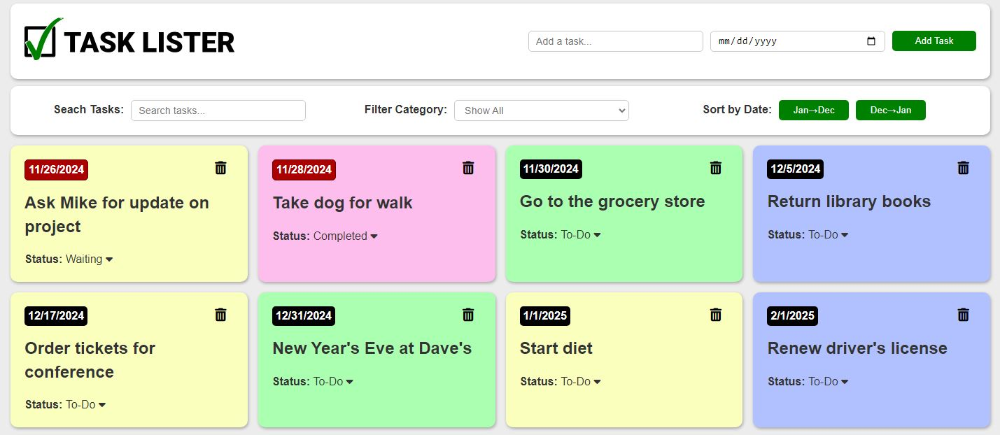
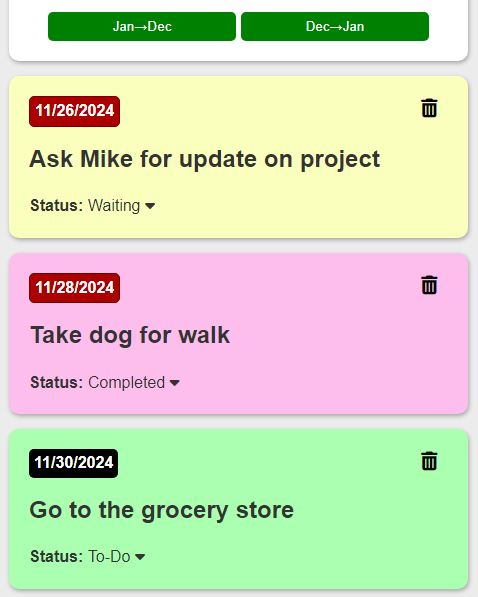

# Task Lister - A Simple Task Tracking App

---

Task Lister is a simple task tracking app that let's you add tasks you that you are looking to keep track of.

You are able to change the status of tasks to "to-do", "in progress", "waiting", and "completed". Once you finish a task and mark it completed, you can delete it when you no longer need to see it.

You, also, have the availability to filter, sort, or search by any of the available columns.

The tasks are saved to a MongoDB database and preserved as long as they are not deleted.

---

## Features

- Add tasks and due dates to the task board.
- Due date background turns red when due date is in the past.
- Sort by due date in both ascending and descending order.
- Search for a task by name and by date.
- Change the status of a task from to one of four different statuses.
  - To-Do
  - In Progess
  - Waiting
  - Completed
- Filter tasks by status to only show tasks in one of the four different statuses.
- Delete a task when no longer needed on list.
- Tasks are preserved to a MongoDB database and loaded on DOM loading.

---

## Tech Used

- HTML
- CSS (no framework or preprocessor)
- Vanilla Javascript using ES6 classes and modules
- Vite

---

## Instructions

1. Clone/download the folder from the GitHub repository.
2. Create a .env file in the main directory.
3. Add MONGO_CONNECT_URI="mongodb-connection-string-goes-here" to the .env file with your MongoDB connection string.
4. In your terminal, from the main directory in NodeJS type "npm install" to install the required dependencies.
5. In the same directory, type "npm run dev" to run the dev server on localhost:5000.
6. In another terminal, CD into the client folder and type "npm install" to install the required dependencies for the client.
7. In the same directory, type "npm run dev" to run the dev server for the client on localhost:3000.
8. If you got a message in your terminal that Mongo DB was connected and you see the client in your terminal, you should be all set up!

---

## Demo

There is no working demo for the full-stack version but below is the working demo for the local storage version.

[Task Lister](https://grantgreene.github.io/task-lister-local-storage/)

---

## Additional Images

